# Raft 工作流程完整分析

> 基于 `raft-java` 源码精确还原，覆盖正常场景与异常场景，每步骤标注入参/出参。

---

## 目录
1. [核心状态机与关键变量](#1-核心状态机与关键变量)
2. [场景一：Leader 选举（正常）](#2-场景一leader-选举正常)
3. [场景二：Leader 选举（异常）](#3-场景二leader-选举异常)
4. [场景三：日志复制（正常）](#4-场景三日志复制正常)
5. [场景四：日志复制（异常——日志冲突）](#5-场景四日志复制异常日志冲突)
6. [场景五：心跳保活（正常）](#6-场景五心跳保活正常)
7. [场景六：快照生成（正常）](#7-场景六快照生成正常)
8. [场景七：快照安装（Follower 日志落后太多）](#8-场景七快照安装follower-日志落后太多)
9. [场景八：客户端写请求完整链路](#9-场景八客户端写请求完整链路)
10. [场景九：节点崩溃恢复](#10-场景九节点崩溃恢复)
11. [消息格式速查](#11-消息格式速查)

---

## 1. 核心状态机与关键变量

```
┌─────────────────────────────────────────────────────────────┐
│                        RaftNode 核心状态                      │
├──────────────────────┬──────────────────────────────────────┤
│ 变量                  │ 含义                                  │
├──────────────────────┼──────────────────────────────────────┤
│ state                │ FOLLOWER / PRE_CANDIDATE /            │
│                      │ CANDIDATE / LEADER                    │
│ currentTerm          │ 当前任期号（持久化）                    │
│ votedFor             │ 本任期投票给谁（持久化，0=未投）         │
│ leaderId             │ 当前 leader 的 id                      │
│ commitIndex          │ 已提交日志最大 index                    │
│ lastAppliedIndex     │ 已应用到状态机的最大 index（volatile）   │
├──────────────────────┼──────────────────────────────────────┤
│ Peer.nextIndex       │ Leader 认为该 peer 下一条需要发的 index  │
│ Peer.matchIndex      │ Leader 确认该 peer 已复制的最大 index   │
└──────────────────────┴──────────────────────────────────────┘

节点状态转换：
  FOLLOWER ──选举超时──→ PRE_CANDIDATE
  PRE_CANDIDATE ──获得多数预投票──→ CANDIDATE
  CANDIDATE ──获得多数投票──→ LEADER
  LEADER/CANDIDATE ──收到更高 term──→ FOLLOWER
```

---

## 2. 场景一：Leader 选举（正常）

**触发条件**：Follower 的选举计时器超时（默认 5000~10000ms 随机）

### 2.1 Pre-Vote 阶段

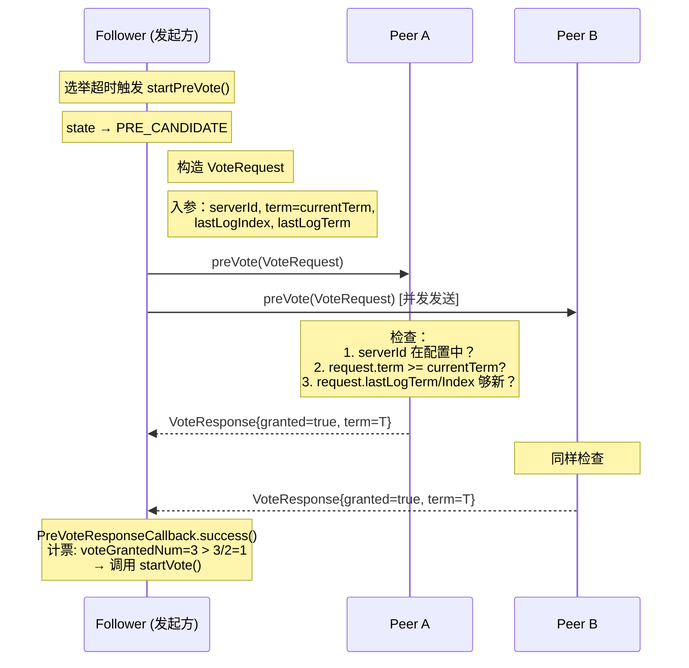

**Pre-Vote 入参（VoteRequest）**

| 字段 | 来源 | 示例值 |
|------|------|--------|
| `server_id` | localServer.getServerId() | `1` |
| `term` | currentTerm（**不加1**） | `5` |
| `last_log_index` | raftLog.getLastLogIndex() | `42` |
| `last_log_term` | getLastLogTerm() | `5` |

**Pre-Vote 出参（VoteResponse）**

| 字段 | 含义 | 示例值 |
|------|------|--------|
| `granted` | 是否同意 | `true` |
| `term` | 响应方当前 term | `5` |

**Peer 侧授权逻辑（RaftConsensusServiceImpl.preVote）**

```
拒绝条件（返回 granted=false）：
  1. serverId 不在 configuration 里
  2. request.term < currentTerm
  3. request.lastLogTerm < myLastLogTerm
     OR (lastLogTerm 相同 && request.lastLogIndex < myLastLogIndex)

授权条件：以上都不满足 → granted=true
```

---

### 2.2 正式 Vote 阶段

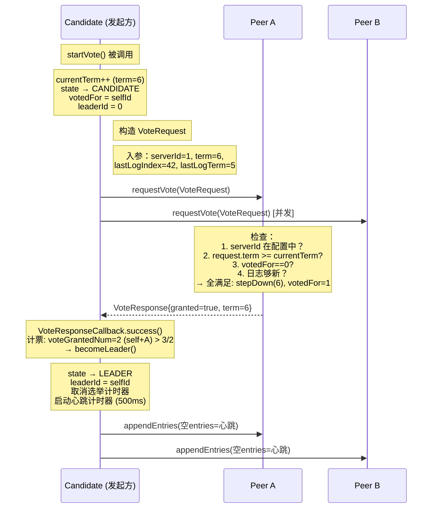

**requestVote 入参（VoteRequest）**

| 字段 | 来源 | 示例值 |
|------|------|--------|
| `server_id` | localServer.getServerId() | `1` |
| `term` | currentTerm（**已加1**） | `6` |
| `last_log_index` | raftLog.getLastLogIndex() | `42` |
| `last_log_term` | getLastLogTerm() | `5` |

**requestVote 出参（VoteResponse）**

| 字段 | 含义 | 授权条件 |
|------|------|---------|
| `granted` | 是否授票 | votedFor==0 且日志够新 |
| `term` | 响应方 term | currentTerm |

---

## 3. 场景二：Leader 选举（异常）

### 异常 A：收到更高 term 响应 → 立即降级

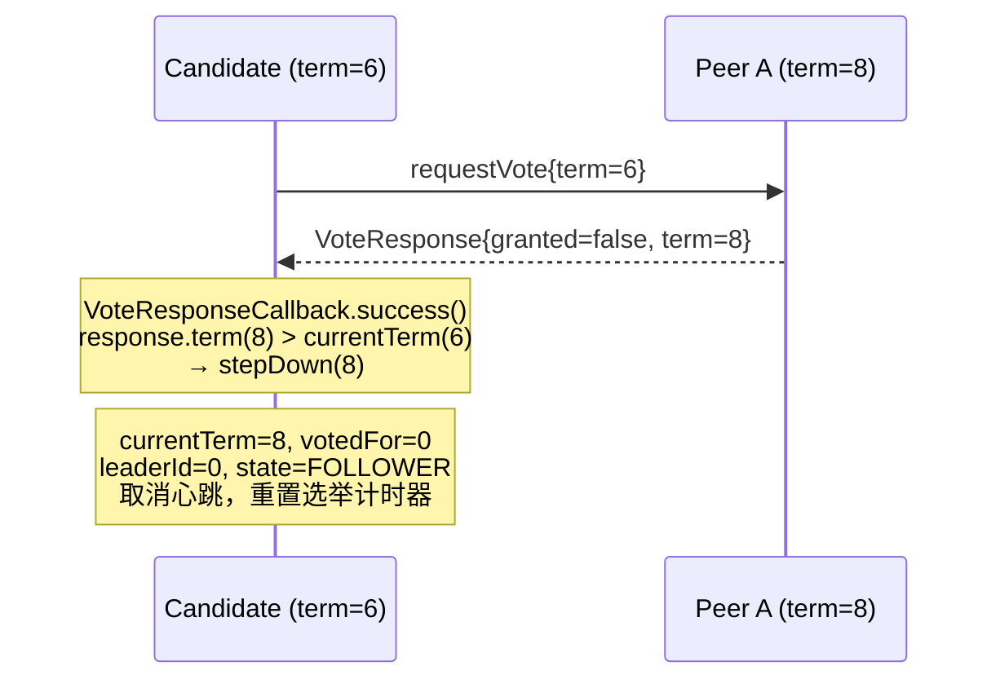

### 异常 B：选票分裂（Split Vote）→ 超时重试

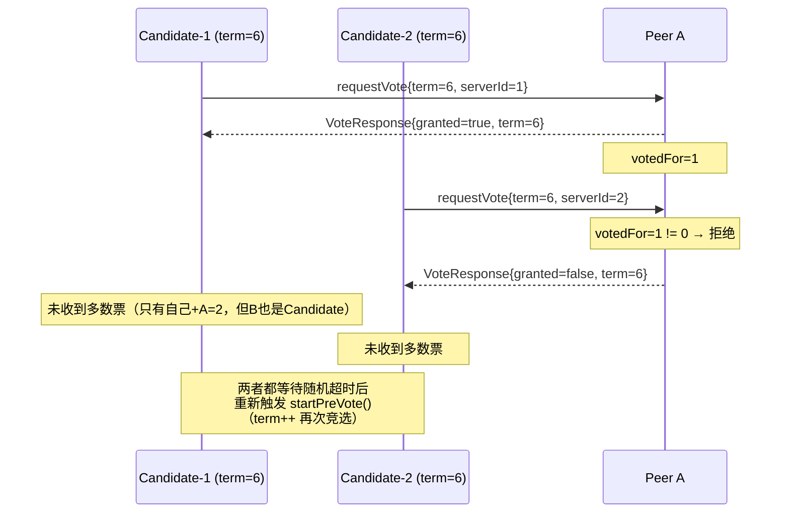

**stepDown 入参/出参**

| 操作 | 条件 | 副作用 |
|------|------|--------|
| 入参：newTerm | newTerm >= currentTerm | |
| 出参：无 | | currentTerm=newTerm, votedFor=0, leaderId=0, state=FOLLOWER, 重置选举计时器 |

### 异常 C：RPC 超时/失败

```
preVote/requestVote RPC 失败时：
  PreVoteResponseCallback.fail()  → peer.setVoteGranted(false)，记录日志，不重试
  VoteResponseCallback.fail()     → peer.setVoteGranted(false)，记录日志，不重试

影响：该 peer 计为反对票，如果多数派票数仍满足，照样晋级；
     否则等待下次选举超时重试整个流程。
```

---

## 4. 场景三：日志复制（正常）

**触发条件**：Client 调用 `replicate()` 或 Leader 发送心跳

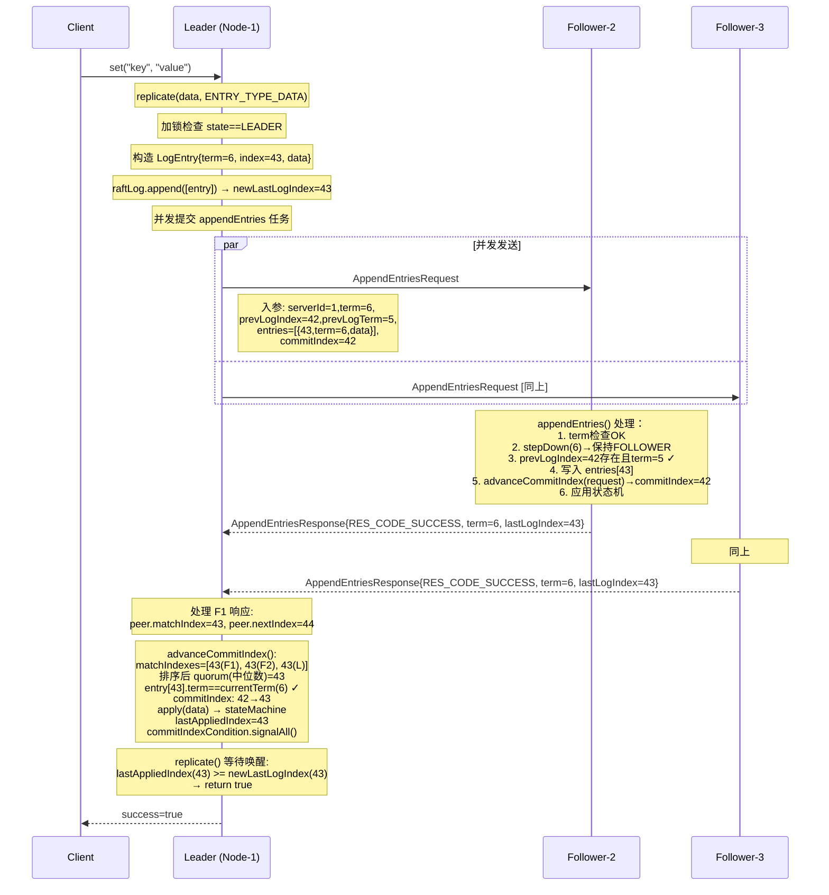

**appendEntries 入参（AppendEntriesRequest）**

| 字段 | 来源 | 示例值 |
|------|------|--------|
| `server_id` | localServer.getServerId() | `1` |
| `term` | currentTerm | `6` |
| `prev_log_index` | peer.nextIndex - 1 | `42` |
| `prev_log_term` | raftLog.getEntryTerm(42) | `5` |
| `entries` | 从 nextIndex 起打包，最多 maxLogEntriesPerRequest 条 | `[{index=43,term=6,data=...}]` |
| `commit_index` | min(commitIndex, prevLogIndex + numEntries) | `42` |

**appendEntries 出参（AppendEntriesResponse）**

| 字段 | 成功时 | 失败时 |
|------|--------|--------|
| `res_code` | `RES_CODE_SUCCESS` | `RES_CODE_FAIL` |
| `term` | currentTerm | currentTerm |
| `last_log_index` | 最新日志 index | 冲突时返回回退建议 |

**advanceCommitIndex 逻辑（Leader 侧）**

```
matchIndexes = [F1.matchIndex, F2.matchIndex, ..., myLastLogIndex]
排序后取 matchIndexes[peerNum/2]  ← 中位数 = quorum
条件：entry[quorum].term == currentTerm（防止提交上一 term 的日志）
若满足：commitIndex = quorum，apply [oldCommit+1..newCommit]
```

---

## 5. 场景四：日志复制（异常——日志冲突）

### 异常 A：Follower 日志有 gap（prevLogIndex 超出 follower 的 lastLogIndex）

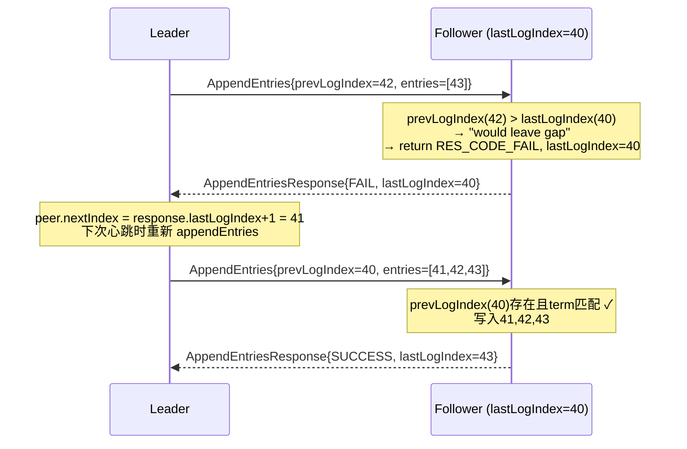

### 异常 B：Follower 日志有冲突（同 index 不同 term）

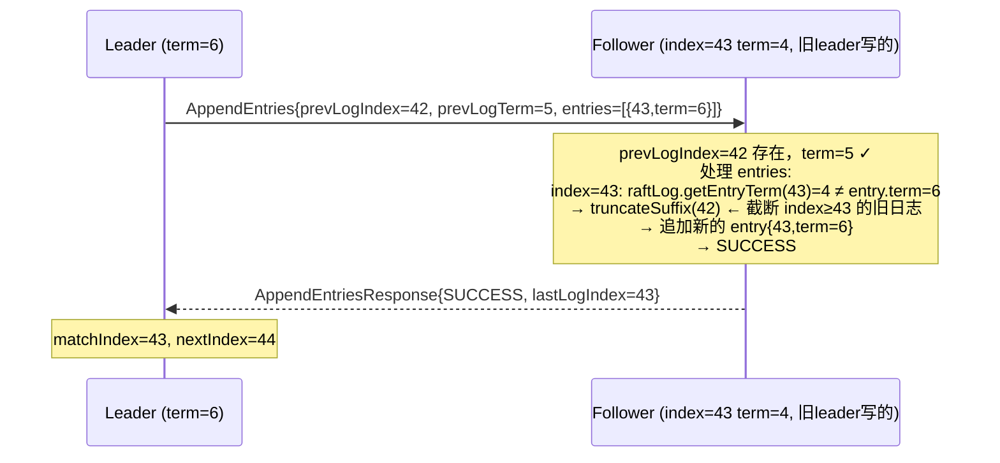

### 异常 C：prevLogTerm 不匹配 → 回退 nextIndex

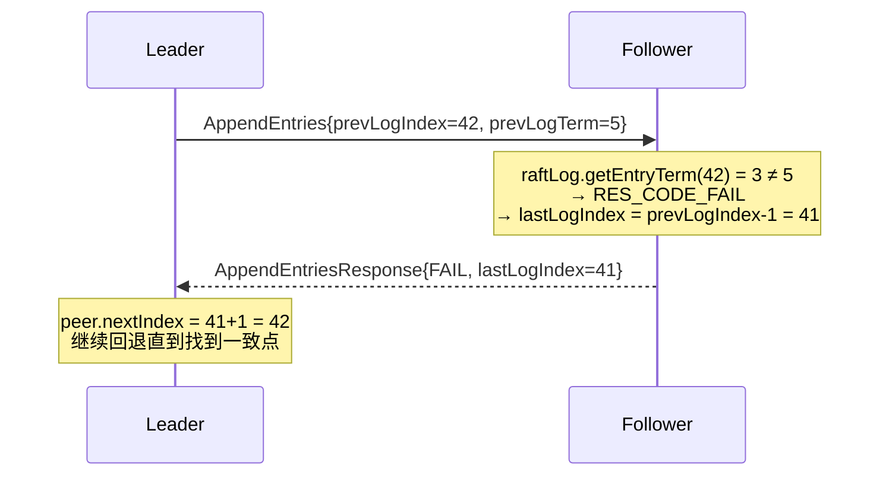

---

## 6. 场景五：心跳保活（正常）

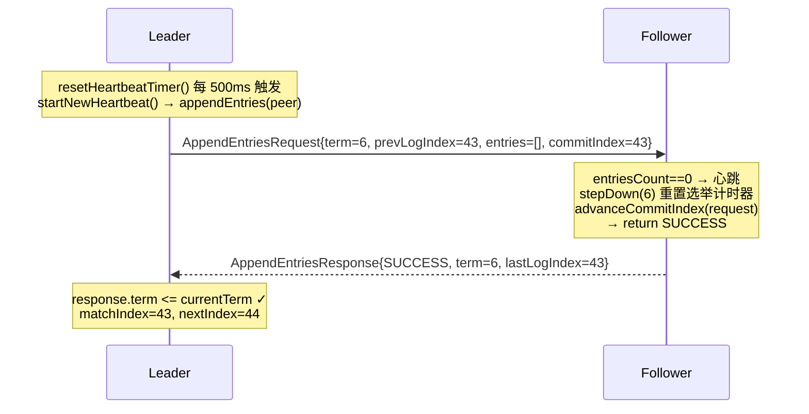

**心跳的核心作用**：
- Follower 收到后调用 `stepDown()` → 重置选举计时器（防止触发不必要的选举）
- 同步 commitIndex 给 Follower → Follower 提交已复制的日志

---

## 7. 场景六：快照生成（正常）

**触发条件**：定时器每 `snapshotPeriodSeconds`（默认3600s）触发，且 `raftLog.getTotalSize() >= snapshotMinLogSize`

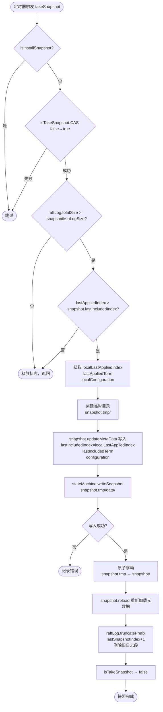

**takeSnapshot 关键参数**

| 参数 | 值 | 说明 |
|------|-----|------|
| 触发阈值 | `snapshotMinLogSize`（默认1GB）| 日志总字节数 |
| 快照时间点 | `lastAppliedIndex` | 已应用到状态机的最新 index |
| 元数据写入 | `lastIncludedIndex`, `lastIncludedTerm`, `configuration` | 恢复时用 |
| 日志截断 | `truncatePrefix(lastSnapshotIndex + 1)` | 删除 index <= lastSnapshotIndex 的段 |

---

## 8. 场景七：快照安装（Follower 日志落后太多）

**触发条件**：`peer.nextIndex < raftLog.firstLogIndex`（Leader 已经把需要的日志删除了）

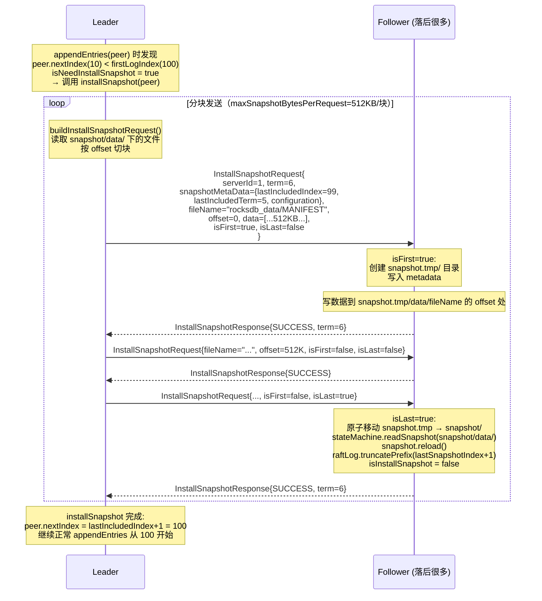

**InstallSnapshotRequest 入参**

| 字段 | 说明 | 示例 |
|------|------|------|
| `server_id` | Leader id | `1` |
| `term` | Leader 当前 term | `6` |
| `snapshot_meta_data` | {lastIncludedIndex, lastIncludedTerm, configuration} 只在 isFirst=true 时填充 | |
| `file_name` | 相对于 snapshot/data/ 的路径 | `"rocksdb_data/MANIFEST"` |
| `offset` | 文件内字节偏移 | `0`, `524288`, ... |
| `data` | 文件数据块 | `byte[512*1024]` |
| `is_first` | 是否第一个包（需清理旧 tmp 目录） | `true/false` |
| `is_last` | 是否最后一个包（触发 apply） | `true/false` |

**异常：快照安装中途失败**

```
Leader: response == null 或 resCode != SUCCESS
  → isSuccess = false → break 循环
  → closeSnapshotDataFiles
  → isInstallSnapshot.set(false)
  → installSnapshot 返回 false
  → appendEntries 直接 return（本次心跳放弃）
  → 下次心跳重新尝试

Follower: IO 异常
  → catch(IOException) → 记录日志
  → responseBuilder.setResCode(FAIL)
  → isInstallSnapshot 在 isLast=true 时才清除（保证幂等）
```

---

## 9. 场景八：客户端写请求完整链路

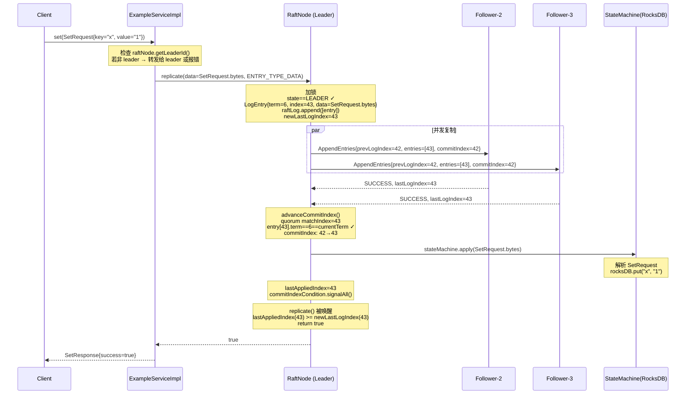

**asyncWrite 模式差异**

```
asyncWrite=false（默认，同步写）：
  replicate() 等待 commitIndexCondition 被 signalAll()
  等待超时 maxAwaitTimeout（默认3000ms）
  超时后若 lastAppliedIndex < newLastLogIndex → return false

asyncWrite=true（异步写）：
  leader 本地写日志成功后立即 return true
  不等待 Follower 确认（牺牲强一致性换取低延迟）
```

**非 Leader 节点的写请求处理**

```
ExampleServiceImpl.set()：
  if (raftNode.getLeaderId() <= 0) → return error "no leader"
  if (raftNode.getLeaderId() != localServer.getServerId())
      → 通过 RPC 代理转发给 leader 节点
```

---

## 10. 场景九：节点崩溃恢复

```mermaid
flowchart TD
    A([节点重启 RaftNode 构造函数]) --> B[SegmentedLog 加载日志元数据<br/>currentTerm, votedFor, firstLogIndex]
    B --> C[Snapshot.reload() 加载快照元数据<br/>lastIncludedIndex, lastIncludedTerm, configuration]
    C --> D[commitIndex = max(snapshot.lastIncludedIndex, 0)]
    D --> E{snapshot.lastIncludedIndex > 0 &&<br/>raftLog.firstLogIndex <= snapshot.lastIncludedIndex?}
    E -- 是 --> F[raftLog.truncatePrefix(lastIncludedIndex+1)<br/>丢弃已包含在快照中的日志]
    E -- 否 --> G
    F --> G[从快照配置恢复 configuration]
    G --> H[stateMachine.readSnapshot(snapshot/data/)]
    H --> I[从 lastIncludedIndex+1 到 commitIndex<br/>重放日志到状态机]
    I --> J[lastAppliedIndex = commitIndex]
    J --> K[init() 初始化线程池<br/>启动快照定时器<br/>resetElectionTimer()]
    K --> L([节点就绪，以 FOLLOWER 身份参与集群])
```

**崩溃场景分析**

| 崩溃时机 | 崩溃影响 | 恢复方式 |
|----------|----------|---------|
| 日志写入前 | 条目未持久化 | 重启后无该条目，Leader 重发 |
| 日志写入后未复制 | 孤立日志条目 | 若 Leader 崩溃：新 Leader 可能覆盖；若 Follower 崩溃：Leader 重发并 truncateSuffix |
| 日志已复制未提交 | 多数 Follower 有该条目 | 新 Leader 选出后提交该条目（日志够新才能当选） |
| 日志已提交 | commitIndex 已更新 | 重启后通过 raftLog 或 snapshot 恢复状态机 |
| 快照写入中途 | snapshot.tmp 存在 | 下次快照重新生成（tmp 目录被覆盖） |

---

## 11. 消息格式速查

### VoteRequest / VoteResponse
```protobuf
message VoteRequest {
    int32 server_id = 1;    // 发起方 id
    int64 term = 2;         // 任期（preVote 不加1，vote 已加1）
    int64 last_log_term = 3;
    int64 last_log_index = 4;
}
message VoteResponse {
    int64 term = 1;
    bool granted = 2;
}
```

### AppendEntriesRequest / Response
```protobuf
message AppendEntriesRequest {
    int32 server_id = 1;
    int64 term = 2;
    int64 prev_log_index = 3;
    int64 prev_log_term = 4;
    repeated LogEntry entries = 5;  // 空 = 心跳
    int64 commit_index = 6;
}
message AppendEntriesResponse {
    ResCode res_code = 1;    // SUCCESS or FAIL
    int64 term = 2;
    int64 last_log_index = 3; // 失败时用于回退 nextIndex
}
```

### InstallSnapshotRequest / Response
```protobuf
message InstallSnapshotRequest {
    int32 server_id = 1;
    int64 term = 2;
    SnapshotMetaData snapshot_meta_data = 3; // 只在 isFirst=true 时填
    string file_name = 4;
    int64 offset = 5;
    bytes data = 6;
    bool is_first = 7;
    bool is_last = 8;
}
message InstallSnapshotResponse {
    ResCode res_code = 1;
    int64 term = 2;
}
```

---

## 异常处理总结表

| 异常场景 | 检测点 | 处理逻辑 | 入参/出参变化 |
|----------|--------|----------|-------------|
| 收到更高 term 的 RPC | 任何 RPC handler | `stepDown(newTerm)` | currentTerm↑, state→FOLLOWER |
| AppendEntries 有 gap | prevLogIndex > lastLogIndex | 返回 FAIL，lastLogIndex=当前值 | peer.nextIndex = lastLogIndex+1 |
| prevLogTerm 不匹配 | raftLog.getEntryTerm(prevLogIndex)!=prevLogTerm | 返回 FAIL，lastLogIndex=prevLogIndex-1 | peer.nextIndex 回退 |
| 日志条目 term 冲突 | entry.term != 本地同 index 的 term | truncateSuffix(index-1) 后追加 | 本地日志截断重写 |
| Follower 落后太多 | peer.nextIndex < firstLogIndex | installSnapshot 分块传送 | peer.nextIndex = lastSnapshotIndex+1 |
| 选票分裂 | voteGrantedNum <= total/2 | 等待超时，下轮选举 term++ 重试 | currentTerm++ |
| 网络断开后恢复 | Pre-vote 阻止 term 飙升 | preVote 不加 term，Peer 以当前 term 比较 | currentTerm 不膨胀 |
| Leader 脑裂 | 收到两个 leader 的 AppendEntries | stepDown(term+1) 强制双方降级 | 两个 leader 都变 FOLLOWER |
| 快照生成与安装并发 | isInstallSnapshot / isTakeSnapshot | 互斥标志，后来者直接返回 | 操作被跳过 |

---

*文档基于 raft-java 源码 `RaftNode.java` + `RaftConsensusServiceImpl.java` 生成*
